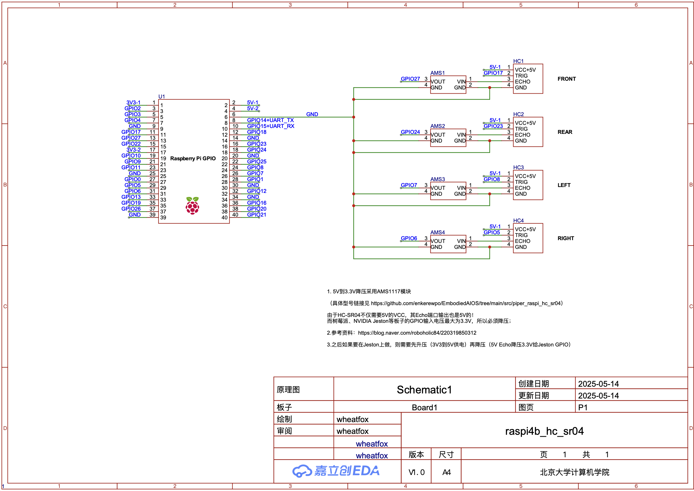

# HC-SR04 超声波传感器驱动（树莓派版）

基于 https://github.com/engcang/HC-SR04-UltraSonicSensor-ROS-RaspberryPi 修改，支持多个超声波传感器和ROS2网络通信。

## 硬件连接注意事项

1. 由于树莓派的输入最大为 3.3V，所以 Echo 过来的 5V 电压不能直接接到树莓派（会烧坏树莓派），需要使用电阻分压或用 AMS1117 芯片降压
2. 这里我采用了 https://detail.tmall.com/item.htm?detail_redpacket_pop=true&id=13301101281&ltk2=1747036883275pdkov4mb4hg9td9q8b49kk&ns=1&priceTId=214782fe17470368710688979e1ba4&query=5V%E9%99%8D%E5%8E%8B3.3V&skuId=4173505841581&spm=a21n57.1.hoverItem.3&utparam=%7B%22aplus_abtest%22%3A%227b45729bdea65b47781027bf9e88793e%22%7D&xxc=ad_ztc 的电路板进行 5V DC 到 3.3V 的降压
3. HC-SR04 的供电电压为 5V，接树莓派 5V 供电即可

系统原理图（2025.5.14）：



## 安装

```bash
# 请先安装 ROS2 humble

cd src/piper_raspi_hc_sr04
source /opt/ros/humble/setup.zsh # or setup.bash
pip install -r requirements.txt

# 运行驱动程序
python3 piper_raspi_hc_sr04/driver.py

# 运行节点
python3 piper_raspi_hc_sr04/node.py
```

TODO: 支持 colcon build，现在只支持上面这样的运行方式不支持 ros2 run 运行

## 查看数据

```bash
ros2 topic list | grep sonic
ros2 topic echo /ultrasonic/sensor0_front
ros2 topic echo /ultrasonic/heartbeat
```

## 配置

传感器配置通过 YAML 文件管理，位于 `sensors.yaml`。配置示例请参考仓库内的 yaml 文件。

每个传感器配置需要：
- `trig`: TRIG 连接的 GPIO 号
- `echo`: ECHO 连接的 GPIO 号
- `name`: 传感器名称


wheatfox wheatfox17@icloud.com 2025